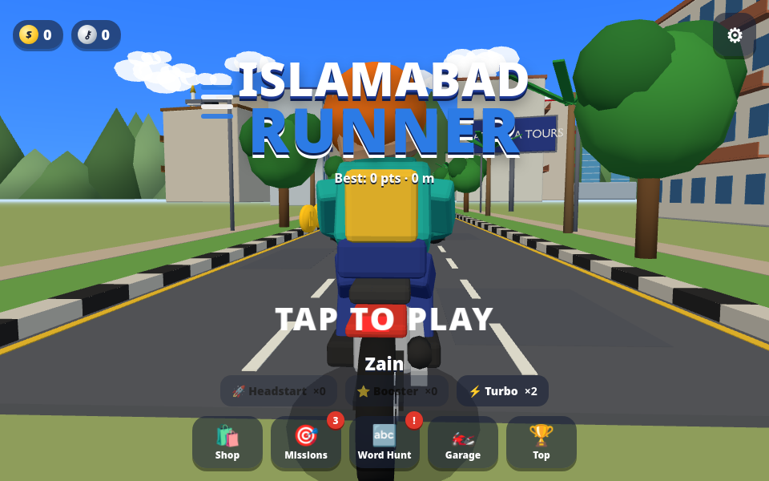
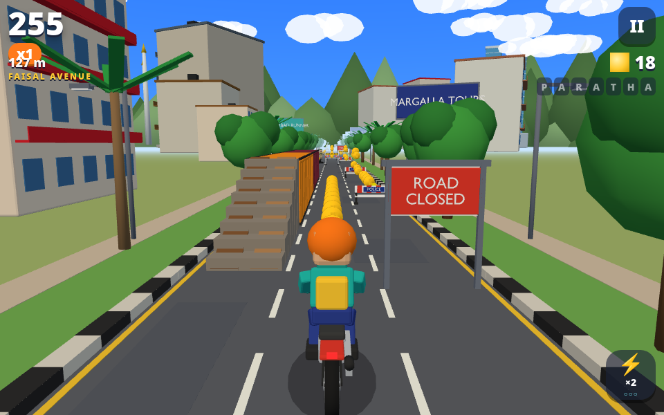
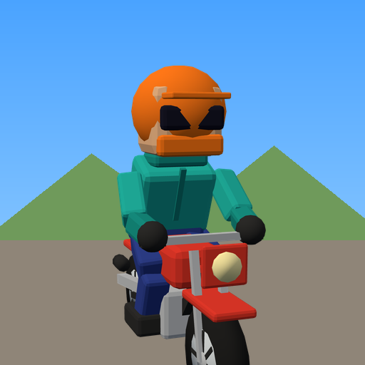
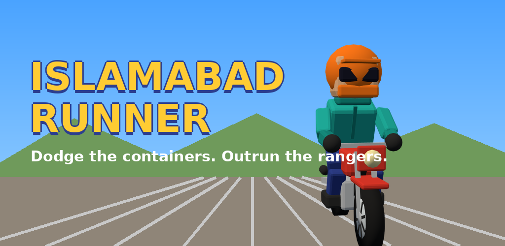
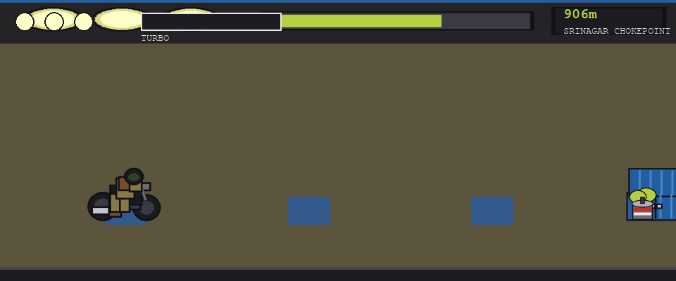

# Islamabad Runner

A satirical endless runner set on the roads of Islamabad during a protest-lockdown
day: containers seal every intersection, rangers patrol on foot, teargas hangs in
the air, army jeeps come the other way, and the mobile internet is down. You're a
biker just trying to get to D-Chowk.

This repo holds **two builds of the same idea**, in the order they were made:

1. **2D prototype** (`game.py`) — a 60–90s pygame side-scroller, the original concept test.
2. **3D game** (`index.html` / `src/`) — a full Subway-Surfers-style rebuild in
   Three.js, with a Capacitor Android wrapper and Play Store listing assets.

The 3D build is the one to actually play; the pygame prototype is kept as the
original proof of concept the idea was validated with.

## 3D game (Three.js)




Subway-Surfers mechanics, Islamabad skin:

| Action | Input | Notes |
|---|---|---|
| Change lane | swipe left / right (A/D, ←/→) | three lanes, bike leans into the turn |
| Jump | swipe up (W/↑/space) | clears barricades, cones, tyre piles |
| Duck ("roll") | swipe down (S/↓) | slides under ROAD CLOSED gantries, tape, teargas; fast-falls in the air |
| Turbo | double-tap (H) | 30s boost, saves you from one crash |
| Pause | ⏸ / Esc | |

- **Containers, container trucks, Metro buses** are the "trains" — ride dirt ramps onto their roofs, hop between them.
- **Army jeeps** are the oncoming trains — lethal.
- **Rangers, cones, tyre piles** make you stumble; two stumbles near rangers = arrested.
- **Signal bubbles** (WhatsApp icon from the prototype) — collect 3 for a Turbo.
- **Biryani box** = mystery box: coins, keys, Turbos, headstarts, character tokens.
- **Keys** revive you. Jetpack, Nitro Springs, Coin Magnet, 2X Multiplier are shop-upgradable power-ups.
- **Zones** loop every 3000m, same as the prototype: Faisal Avenue → Srinagar Chokepoint → Red Zone → D-Chowk final sprint. Reaching D-Chowk pays a bonus; getting arrested shows the prototype's lose line.
- 7 riders, 6 bikes, 50 mission sets (up to 30x multiplier), Daily Word Hunt with streak rewards, local leaderboard, procedural music & SFX. No ads, no tracking, fully offline.

### Run it (web)

```bash
npm install
npm run dev       # Vite dev server → http://localhost:5173
npm run build     # production build → dist/
```

### Run it (Android)

```bash
npm run android   # builds web, then npx cap sync android
# open android/ in Android Studio to run on device/emulator
```

### Regenerate assets

```bash
npm run assets     # runs the Blender scripts in tools/blender/*.py → public/models/*.glb
```

### Project layout

```
index.html, src/            Vite + Three.js game (ES modules)
  src/game/Game.js          state machine, scoring, power-ups, camera
  src/game/Track.js         procedural road: lane plans, obstacles, scenery, collisions
  src/game/Player.js        biker controller (lanes, jump, duck, turbo, jetpack)
  src/game/Chaser.js        the two rangers
  src/ui/UI.js, ui.css      HUD, menus, shop, missions, word hunt, settings
  src/data/                 characters, bikes, missions, daily words
tools/blender/*.py          bpy scripts that generate EVERY 3D asset (public/models/*.glb)
tools/play.js               headless Playwright harness (screenshots, bot, soak test)
android/                    Capacitor Android project (API 36, portrait, immersive)
store/                      Play Store icon, feature graphic, splash
docs/store-listing.md       listing copy + data-safety answers
public/privacy.html         privacy policy (host it and paste the URL in Play Console)
```

### Store assets

| | |
|---|---|
|  |  |

---

## 2D prototype (pygame)

The original concept test — a 60–90s auto-scrolling motorcycle runner. Tap to
jump, hold to duck, double-tap to turbo. Reach D-Chowk (distance goal) to win;
0 HP = arrested.



The run is split into four zones that get progressively more hostile:

| Zone | Distance | Vibe |
|---|---|---|
| Faisal Avenue | 0–700m | Warm-up, low obstacle density |
| Srinagar Chokepoint | 700–1600m | Density ramps up |
| Red Zone | 1600–2600m | Heaviest obstacle density, jeeps start appearing |
| D-Chowk — Final Sprint | 2600–3000m | No new obstacles, just outrun the clock |

**Win:** reach 3000m (D-Chowk) — "You reached D-Chowk! Mobile internet still
blocked. But you made it."
**Lose:** HP hits 0 — "Arrested. 954 others join you today. Section 144 is still
in effect."

### Character & obstacles

| Sprite | Role |
|---|---|
| Biker (player) | 3-frame ride animation, jumps/ducks, glows green when turbo is active |
| Shipping container | Static obstacle, jump over |
| Traffic cone | Static obstacle, jump over |
| Teargas canister | Rolling animated obstacle, duck under |
| Ranger | Walking animated obstacle, jump over |
| Army jeep | Wide static obstacle (Red Zone onward), jump over |
| WhatsApp icon | Collectible — fills turbo meter |
| Biryani box | Collectible — restores 1 HP |

Player starts with 3 HP and a 1.2s invulnerability window (sprite flickers) after each hit.

### Controls

| Input | Action |
|---|---|
| Tap (Space / click) | Jump |
| Hold Down arrow | Duck |
| Double-tap | Turbo boost (needs a full turbo meter, 1.8x speed for 2s) |

### Run it

```bash
python3 -m venv venv
source venv/bin/activate
pip install pygame
python3 game.py
```

### Assets

Two asset pipelines exist, both procedural (no hand-drawn or purchased art):

**`generate_sprites_pil.py`** — the one `game.py` actually loads (`assets/sprites_pil`).
Draws every sprite with Pillow as flat-color shapes with a 3px black outline, on a
shared palette (PTI blue for containers, khaki for the ranger, olive for the jeep,
teargas green-yellow, biryani brown/saffron). This is what's on screen in-game:

| Sprite | Design |
|---|---|
| **Biker (player)** | Side-view motorcycle (2 wheels, tank, exhaust) + rider in a khaki jacket with a brown backpack, dark helmet, tinted visor. 3-frame spritesheet (neutral / lean-forward / lean-back) for the ride animation. |
| **Ranger** | Khaki uniform, dark green beret, sunglasses, black boots, belt — 2-frame walk cycle (legs/arms alternate). |
| **Container stack** | Two PTI-blue shipping containers stacked, corrugated ribs, chrome door handles. |
| **Army jeep** | Olive-drab body, dark cab top, tinted windshield, a small star insignia on the hood. |
| **Teargas canister** | Grey cylinder with a red warning band, white label stripe, and a yellow-green gas puff that shifts position across 3 frames to fake rotation as it rolls. |
| **Traffic cone** | Orange with a white reflective stripe, black outline. |
| **WhatsApp icon** (collectible) | Green phone silhouette with white WiFi-style signal arcs and a glow halo — turbo fuel. |
| **Biryani box** (collectible) | Brown takeaway box, lid ajar showing rice + saffron strands, steam puffs rising — the healing item. |
| **HUD bar** | Dark asphalt panel, 3 round "headlight" HP indicators, a turbo meter bar, distance counter. |

**`generate_assets.py`** — an earlier/alternate pass that calls Pollinations.ai
(free text-to-image, `flux` model) for a more painterly sprite set plus the
background art, one per zone, all real Islamabad geography reskinned for the runner:

| Background | Setting |
|---|---|
| `bg_boulevard` | Faisal Avenue — wide boulevard, smoggy grey sky, palm trees (Zone 1) |
| `bg_chokepoint` | A street sealed with stacked blue containers, yellow teargas haze in the air (Zone 2) |
| `bg_redzone` | Constitution Avenue — government building domes / parliament in the distance, heavy smog, dramatic sky (Zone 3) |
| `bg_finish` | D-Chowk — the parliament gate and open plaza, the finish line (Zone 4) |

There's also an unused `ui/logo` prompt (motorcycle-runner title art, blue/yellow-green,
smoggy backdrop) generated but never wired into `game.py`, which draws its zone
backgrounds as flat colors + simple shapes rather than these AI images.

More preview frames from a test run: `preview_frame2.png`, `preview_frame3.png`, `preview_win.png`.

## Original design spec

The game started from a design doc written before either build:
`docs/superpowers/specs/2026-07-02-islamabad-runner-design.md` in the
[personal-agent-v2](https://github.com/oyekamal) repo — targets Flutter/Flutter
Flame and maps obstacles to real protest locations (Peshawar Mor → Faisal Avenue
→ Zero Point → D-Chowk). Both builds here are implementations of that same idea
on different engines (pygame, then Three.js).
